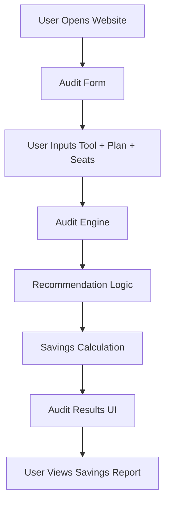

# Architecture

## System Overview

The AI Spend Audit application is a Next.js web application that helps startups identify overspending on AI tools and APIs.

Users input:

* AI tool
* Current plan
* Team seats

The application processes the data through a rule-based audit engine and returns:

* Recommendations
* Monthly savings
* Annual savings
* Reasoning behind the recommendation

---

# System Diagram

---

# Data Flow

1. User visits landing page
2. User selects AI tool, pricing plan, and number of seats
3. Form data is stored in local state
4. Audit engine evaluates the input
5. Rules determine optimization opportunities
6. Savings are calculated
7. Results are displayed instantly

---

# Stack Choice

## Next.js

Chosen for:

* Fast deployment with Vercel
* React ecosystem
* App Router support
* Strong TypeScript support
* Excellent developer experience

## TypeScript

Chosen for:

* Type safety
* Better debugging
* Safer refactoring
* Improved maintainability

## Tailwind CSS

Chosen for:

* Rapid UI development
* Utility-first styling
* Responsive design support
* Cleaner component styling

---

# Scalability Considerations

If the system handled 10,000 audits/day:

* Add a backend database using Supabase or PostgreSQL
* Move audit rules into configurable JSON or database tables
* Cache pricing data
* Add authentication for enterprise users
* Introduce analytics and monitoring
* Add API rate limiting
* Use edge functions for faster global performance

---

# Future Improvements

* AI-generated summaries using Anthropic API
* PDF export
* Benchmark comparisons
* Email capture and CRM integration
* Shareable audit URLs
* Advanced pricing intelligence
